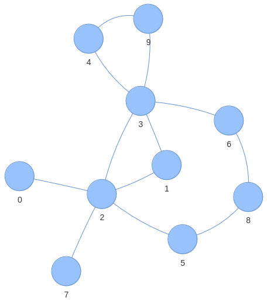

# Laboratorio 9
Gli obiettivi principali di questo laboratorio sono:
- *args e **kwargs
- classi astratte (ABC)
- staticmethod, classmethod e property
- second order functions e decorators
- eccezioni

L'ultimo esercizio riguarda l'esplorazione dei grafi.

## Esercizio 1
Sviluppare la classe astratta *Shape* che eredita da *ABC*, rappresentante una figura geometrica.
Il costruttore accetta come unico parametro il nome che si vuole associare alla figura.
(ad es., "figura1", "la mia forma", etc...)
Il nome deve essere ottenibile tramite opportuno getter.
La classe possiede due metodi astratti che restituiscono, rispettivamente, il perimetro e l'area della figura.

La classe *Triangle*, rappresentante un triangolo, eredita da *Shape*.
Il suo costruttore, oltre al nome del triangolo,
accetta la lunghezza della base e un numero variabile di lunghezze degli altri lati.
Se viene fornita solo la lunghezza della base il triangolo è equilatero,
se viene fornita la lunghezza di un altro lato il triangolo è isoscele, altrimenti è scaleno.

Implementare i metodi astratti che della classe padre che restituiscono area e il perimetro.
Per il calcolo dell'area in modo generico si può utilizzare la
[formula di Erone](https://it.wikipedia.org/wiki/Formula_di_Erone).

La classe *Square* eredita da *Shape* e rappresenta un quadrato.
Il suo costruttore, oltre a nome del quadrato, accetta la lunghezza del lato.
Implementare i metodi astratti della classe padre che restituiscono l'area e il perimetro.

## Esercizio 2
Sviluppare la classe *Thermostat* rappresentate un termostato.
Il costruttore accetta come parametri la temperatura target da mantenere
e un valore booleano che esprime se l'utente vuole usare gradi Celsius o Fahrenheit.
La classe presenta due metodi statici (*staticmethod*)
che trasformano gradi Celsius in Fahrenheit e viceversa.

Sviluppare un metodo di classe (classmethod) che restituisce una nuova istanza della classe *Thermostat*,
copia di quella passata come parametro (questo è similare al costruttore di copia trovato in altri linguaggi).

Sia la temperatura target che il valore booleano devono essere ottenibili
e settabili tramite properties (usare gli appositi decoratori).
Se la temperatura impostata supera i 30 Celsius (o equivalente Fahrenheit)
limitarla a 30 Celsius (o equivalente Fahrenheit).

Per la temperatura ricordare che viene sia fornita che restituita nel formato (Celsius o Fahrenheit)
definito in quel momento. Inoltre, cambiare il formato non deve cambiare la temperatura target impostata.

**SUGGERIMENTO**: Per gestire i formati Celsius o Fahrenheit
è conveniente sceglierne uno solo per rappresentazione interna alla classe e poi fare le dovute conversioni
nei getter e setter (in questo caso definiti tramite properties).

## Esercizio 3
Scrivere due decoratori per funzioni con argomenti sconosciuti (*args, **kwargs).
Il primo decoratore, ```repeat_ten_times(f)```, fa in modo che la funzione decorata sia invocata 10 volte.
Il secondo decoratore, ```time_execution(f)```,
stampa il tempo di esecuzione della funzione decorata, espresso in nanosecondi, dopo averla invocata.

Sviluppare la classe *Greet*, il cui costruttore accetti come parametro il nome della persona da salutare.
Il metodo ```say_hello(self) -> None``` stampa a schermo la scritta *"Hello"* seguita dal nome della persona
(ad es., *"Hello Pietro"*)

Il metodo ```say_good(self, time_of_day: str) -> None``` 
accetta come parametro un stringa contente il periodo della giornata (ad es., *"morning"*, *"afternoon"*, ecc...),
e stampa a schermo la scritta *"Good"* seguita dal periodo della giornata e il nome della persona
(ad es., *"Good evening Pietro"*).

Decoratore i due metodi con entrambi i decoratori, usandoli in ordine opposto.
Scrivere un main che testi i due metodi e notare le differenze dovute all'ordine dei decoratori.

**SUGGERIMENTO**: per calcolare il tempo di esecuzione di una funzione, importare *time*
e chiamare ```time.perf_counter_ns()``` prima e dopo averla invocata.
La differenza dei valori restituiti da ```time.perf_counter_ns()``` è il tempo di esecuzione in nanosecondi.

## Esercizio 4
Scrivere un programma che permetta di gestire il noleggio di alcuni veicoli.
I veicoli sono caratterizzati da una targa e dalla categoria di veicolo.
Le patenti di guida sono caratterizzate da un nome e da un insieme di categorie veicolo che è possibile guidare.
Scrivere classe ```VehicleRental``` che permetta di aggiungere veicoli da noleggiare, e le patenti dei clienti.

La classe deve avere un metodo per noleggiare un veicolo data la targa e il nome sulla patente.
Il metodo deve lanciare eccezioni di tipo diverso per ciascuno dei seguenti eventi:
- la targa non è presente tra i veicoli registrati
- la patente del cliente non è stata registrata
- il veicolo è già stato noleggiato
- la patente di guida non è idonea per il veicolo che si vuole noleggiare

Tutte le eccezioni devono ereditare dall'eccezione ```RentalException```, ed essere strutturate in modo ereditario due categorie, a seconda che riguardino un problema del veicolo e della patente.
Testare il metodo catturando le eccezioni in modo annidato, per esempio gestendo separatamente i problemi legati alla patente, ma allo stesso modo quelli riguardanti il veicolo.

## Esercizio 5
Scrivere una classe per rappresentare il grafo **INDIRETTO** e **NON PESATO** in figura, utilizzando la rappresentazione che si preferisce.

Scrivere un metodo che permetta di trovare un percorso tra due nodi, di cui vengono forniti gli identificativi.
Per la ricerca dei percorsi, implementare sia la **Breadth First Search** che la **Depth First Search**, e permettere all'utente di selezionare l'algoritmo di ricerca tramite un parametro aggiuntivo.
Esempio:

```
Input: 1, 4
Output: [1, 3, 9 ,4]
```

Facendo alcune prove, che differenza si nota tra i risultati dei due algoritmi?



